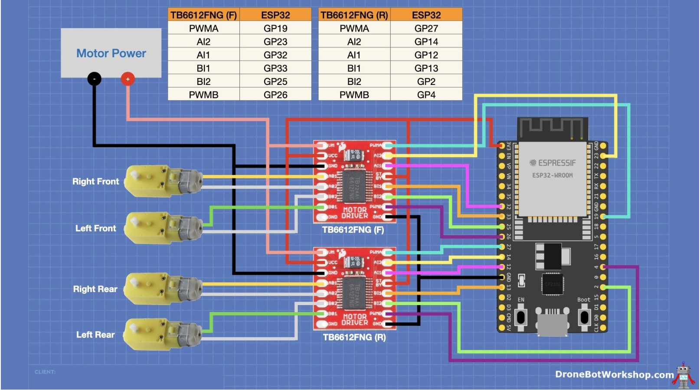

  

    <h1 align="center">-Embedded-Mobile-Robot</h1>

## Introduction
In the world of robotics, combining mechanical engineering, advanced electronics, and smart software leads to the creation of smart and adaptable robots. Our project for the MEAM5100 Mechatronics System Design course is a great example of this combination. We've built an mobile robot that can move around and interact with its environment in many different ways. This robot is special because it has mecanum wheels, which allow it to move smoothly in any direction, making it very agile and precise.

Our main goals were to make the robot follow walls closely, track a beacon accurately, and push a model of a police car. Achieving these goals meant bringing together the mechanical structure, electrical systems, and software of the robot in a way that shows our technical skill and creativity.

  
  

## Mechanical Design

<b>Frame Design:</b> 
The chassis is laser-cut from acrylic, providing a sturdy yet lightweight foundation.

<b>Wheels: </b>Mecanum wheels are used, allowing omnidirectional motion.

<b>Motor Mounts:</b> Custom-designed and 3D printed motor mounts provide stability.

<b>Design Considerations:</b> A modular approach with strategic placement of components for optimized space utilization and functionality.

  

## Electrical Design : 

### 1. Power Distribution

<b> Power Source:</b> The robot is powered by a LiPo battery, providing sufficient current for motors and sensors.

<b>Voltage Regulation:</b> Voltage regulators are used to step down the battery voltage to suitable levels for different components like microcontrollers and sensors.

### 2. Motor Driver Circuit

<b>Motor Drivers:</b> TB6612FNG motor drivers are used for controlling the mecanum wheels.
Motor drivers are interfaced with the ESP32 S2 microcontroller. PWM signals control the speed, and digital signals determine the direction.

  

### 3. Communication Modules

<b>WiFi Module:</b> Integrated into the ESP32 S2 for wireless communication, crucial for receiving data from the HTC Vive system.

<b>Serial Communication:</b> Used for debugging and inter-module communication between the ESP32 and ATMega32u4 controllers.

## Embedded System Design

### 1. Microcontroller Selection
<b>Primary Controller - ESP32 S2:</b> Chosen for its processing power, WiFi capabilities, and ample I/O options. Handles high-level tasks like motor control, sensor data processing, and communication.

<b>Secondary Controllers- ATMega32u4: </b> Dedicated to specific tasks like IR beacon tracking, providing efficient task segregation and parallel processing.

  
  

### 2. Firmware Development

<b>Modular Code Structure:</b> The firmware is organized into modules for motor control, sensor readings, communication, and decision-making algorithms.

<b>Interrupts and Timers:</b> Used for precise motor control, sensor data acquisition, and maintaining synchrony with the Vive system.

### 3. System Integration

<b>Sensor Fusion: </b> 

<b>a. Ultrasonic Sensors:</b> Utilized for distance measurement in wall-following. They are interfaced with the microcontroller using digital I/O pins.

<b> b. IR Sensors: </b>Phototransistors and operational amplifiers form the core of the IR detection circuit. This circuit is tuned to detect specific IR frequencies for beacon detection.

<b> c. vive positioning: </b> Vive detection circuit is used as a positioning device to localize the robot with respect to world frame.

  
  

Combining data from ultrasonic sensors, IR sensors, and the Vive system for accurate environmental perception and decision-making.

<b> Feedback Loops: </b> Employing PID control algorithms for precise motor control, wall-following, and beacon tracking.

## Software Architecture

### 1.. Beacon Tracking
For this a frequency detection circuit is employed with secondary ATMega32U4 controller to detect the beacon with 550Hz and 23Hz. The robot sweeps a specific area, moving in various directions (right, forward, left), and periodically checks the states of phototransistors to identify the beacon’s location.
Upon both phototransistors indicating a high signal (beacon detected), the robot moves forward.
If the beacon is not detected, the robot rotates counterclockwise. This flow ensures the robot autonomously follows the beacon’s signal and adjusts its movement accordingly.

  

### 2. Police Car Push
The software uses Vive trackers for positioning and includes PID control for movement and rotation. It establishes a WiFi connection, sends UDP packets with positional information. The robot sweeps in the Y-direction based on Vive location data until it aligns with the police car location sent over UDP. It then moves forward, pushing the police car.

  

### 3. Wall Following

The wall-following algorithm utilizes two ultrasonic sensors. 
<b>followWall():</b> This function calculates the wall-following error using PID control, based on target distances from the wall and sensor readings.
<b>calculateMecanumWheelSpeeds():</b> Determines individual wheel speeds for the mecanum wheels based on the estimated error.

<b>Process Flow:</b> The loop function continuously reads distances from the ultrasonic sensors, adjusts motor speeds to maintain the desired distance from the wall, and triggers a rotational movement if needed.

  

#### More details of code struecture and circuit diagram can be found in the project report.
---

##  License

This project is protected under the [MIT] License. For more details, refer to the [LICENSE](https://choosealicense.com/licenses/mit/) file.

---

